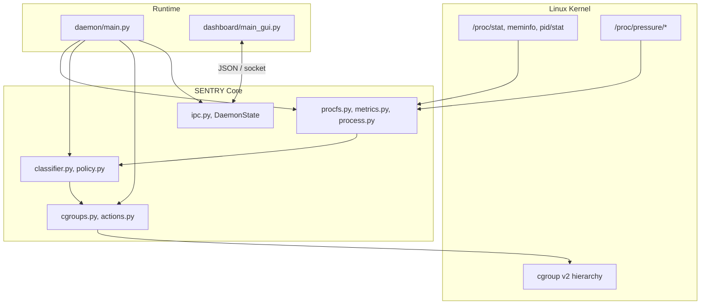

<div align="center">

# SENTRY

### Kernel-Aware Resource Pressure Governor for Linux

**Sense contention. Classify stress. Enforce limits through cgroups v2 -- not process killing.**

<br>

[](https://kernel.org)
[](https://python.org)
[](https://docs.kernel.org/admin-guide/cgroup-v2.html)
[](https://www.kernel.org/doc/html/latest/accounting/psi.html)
[](LICENSE)

<br>

[Architecture](#architecture) &middot; [Kernel Interfaces](#kernel-interfaces) &middot; [Quick Start](#quick-start) &middot; [Safety Model](#safety-model) &middot; [PSI Integration](#psi-integration) &middot; [Roadmap](#roadmap)

</div>

---

## The Problem

Modern Linux hosts fail **quietly** under resource pressure.

High CPU does not always mean distress. Low CPU does not always mean health. When memory compacts, I/O queues stall, and the scheduler falls behind, users experience freezes long before `top` tells you anything is wrong.

Most tools **observe**. Few **intervene**. Fewer still intervene **safely** at the kernel boundary.

**SENTRY** sits in that gap: a userspace control plane that reads kernel signals, reasons about pressure, and applies **reversible** resource limits through **cgroups v2**.

```
  WITHOUT SENTRY                         WITH SENTRY
  ----------------                       ---------------------------------
  Background compile hogs CPU     -->    Stress trend rises
  Desktop becomes unresponsive    -->    PSI + /proc deltas confirm pressure
  User force-kills random PIDs    -->    Target workload isolated in cgroup
  Work lost, state corrupted      -->    cpu.weight applied -> system recovers
```

---

## What Makes This Systems Work

SENTRY is not a wrapper around `ps` with a chart. It is built directly on operating system primitives:

| Layer | Mechanism | What SENTRY does |
|-------|-----------|------------------|
| **Scheduler** | `/proc/stat` jiffies | Delta-based CPU + I/O wait (instantaneous, not cumulative) |
| **Memory** | `/proc/meminfo` | `MemAvailable`-aware pressure scoring |
| **Process** | `/proc/[pid]/stat` | Per-PID CPU from kernel jiffies -- not lifetime `ps %cpu` |
| **Pressure** | `/proc/pressure/{cpu,memory,io}` | Linux PSI stall signals (avg10) |
| **Control** | `cgroup v2` | `cpu.weight`, `memory.max`, `io.max` via sysfs |
| **IPC** | Unix socket / TCP | Dashboard <-> daemon JSON control plane |

This is the same conceptual stack used by **systemd-oomd**, **Facebook's PSI research**, and **container resource managers** -- implemented here as an explicit, readable control loop.

---

## Architecture



### Control Loop (every 3s)

```
    +-------------+     +-------------+     +-------------+     +-------------+
    |   SENSE     |---->|   ANALYZE   |---->|   DECIDE    |---->|    ACT      |
    |             |     |             |     |             |     |             |
    | /proc/stat  |     | Stress score|     | Policy tier |     | cgroup v2   |
    | /proc/mem   |     | Trend window|     | Cooldowns   |     | cpu.weight  |
    | /proc/pid   |     | Top offender|     | Safety gate |     | (mem/io WIP)|
    | PSI avg10   |     | PSI score   |     | PSI-aware   |     |             |
    +-------------+     +-------------+     +-------------+     +-------------+
           ^                                                            |
           +---------------------- feedback loop -----------------------+
```

### Repository Layout

```
SENTRY/
|-- core/
|   |-- procfs.py            # /proc parsing (mockable via SENTRY_PROC_ROOT)
|   |-- metrics.py           # SystemMetricsSampler + PSI-aware stress score
|   |-- process.py           # Per-PID jiffies sampler
|   |-- classifier.py        # Trend detection + dashboard hints
|   |-- policy.py            # Escalation matrix + thresholds
|   |-- cgroups.py           # cgroup v2 writers (cpu / memory / io)
|   |-- ipc.py               # DaemonState + JSON socket protocol
|   |-- config.py            # YAML configuration loader
|   `-- platform/            # Linux + Windows adapters
|-- daemon/main.py           # Control loop + IPC server
|-- dashboard/main_gui.py    # Flet UI + IPC client
|-- tests/                   # Mocked /proc fixtures + PSI integration tests
`-- sentry_config.yaml       # Thresholds, escalation, metrics, critical processes
```

---

## Kernel Interfaces

### Stress Score

SENTRY fuses utilization and **pressure signals** into a normalized `[0, 1]` score:

```
stress = (w_util * utilization_score) + (w_psi * psi_score)

where:
  utilization_score = (0.50 * cpu%) + (0.30 * mem%) + (0.20 * io_wait%)
  psi_score = (0.30 * cpu_psi) + (0.40 * memory_psi) + (0.30 * io_psi)
  w_util = 1.0 - psi_weight
  w_psi = psi_weight (opt-in, defaults to 0.0)
```

All weights are configurable in `sentry_config.yaml`.

### PSI Integration

**What is PSI?** Pressure Stall Information reports kernel-level stalls indicating actual contention—when tasks are blocked waiting for resources. Unlike utilization (% CPU used), PSI detects when users *perceive* slowness: memory compaction stalls, I/O queue waits, CPU overcommit delays.

**How SENTRY uses PSI:**
1. Reads `avg10` from `/proc/pressure/{cpu,memory,io}` — 10-second moving average of stall time (%)
2. Normalizes each to [0, 1]
3. Combines with configurable weights: memory stalls (40%) → CPU stalls (30%) → I/O stalls (30%)
4. **Optionally** blends the unified PSI score into the stress formula (default: 0%, opt-in)

**Why opt-in?** Default `psi_weight: 0.0` ensures backward compatibility. Existing deployments unaffected until explicitly tuned.

### Classification Tiers

| Level | Default Threshold | Daemon Response |
|-------|-------------------|-----------------|
| `LOW` | < 0.35 | Monitor only |
| `MODERATE` | 0.50 | cgroup CPU weight -> 50 |
| `HIGH` | 0.70 | cgroup CPU weight -> 30 |
| `CRITICAL` | 0.85 | cgroup CPU weight -> 10 |

> When PSI is integrated, stress thresholds respond to actual contention, not just utilization. A 40% CPU load with 50% memory stalls may now escalate faster than a 70% CPU load with no stalls.

### Signals SENTRY Reads

```c
// Conceptual -- actual reads are from procfs
/proc/stat                          -> CPU idle, iowait, total jiffies (delta sampled)
/proc/meminfo                       -> MemTotal, MemAvailable
/proc/[pid]/stat                    -> utime, stime per process (delta sampled)
/proc/pressure/cpu                  -> some avg10, full avg10
/proc/pressure/memory               -> some avg10, full avg10
/proc/pressure/io                   -> some avg10, full avg10
/sys/fs/cgroup/sentry_bg/cpu.weight -> control surface
```

---

## PSI Integration

### Configuration

Add or edit PSI weights in `sentry_config.yaml`:

```yaml
metrics:
  # Utilization weights (sum to ~1.0)
  cpu_weight: 0.5
  memory_weight: 0.3
  io_weight: 0.2
  
  # PSI blending weight (0.0 = disabled, opt-in)
  psi_weight: 0.2        # Blend 20% PSI, 80% utilization
  
  # How to weight individual PSI resource stalls (sum to ~1.0)
  psi_cpu_weight: 0.3    # CPU stalls contribute 30%
  psi_memory_weight: 0.4 # Memory stalls contribute 40%
  psi_io_weight: 0.3     # I/O stalls contribute 30%
```

### Tuning Guide

**Starting Point (Gaming / Interactive Desktop):**
```yaml
metrics:
  cpu_weight: 0.4
  memory_weight: 0.3
  io_weight: 0.1
  psi_weight: 0.2        # Blend PSI for responsiveness
```

**Balanced (Development Server):**
```yaml
metrics:
  cpu_weight: 0.5
  memory_weight: 0.3
  io_weight: 0.2
  psi_weight: 0.0        # Utilization-only (opt-in)
```

**Aggressive (Heavily Loaded Server):**
```yaml
metrics:
  cpu_weight: 0.3
  memory_weight: 0.4
  io_weight: 0.2
  psi_weight: 0.1        # Light PSI weighting
  psi_memory_weight: 0.5 # Memory stalls are critical
```

### Example Metrics Report

```
[SENTRY] Daemon tick
CPU=45% | MEM=62% | IO=3% | Stress=0.48 | Level=HIGH | Target=chrome(1234)
ProcessScore=38.5 | Action=Observe only (mitigation disabled)
PSI_CPU=12.3 | PSI_MEM=4.1 | PSI_IO=0.8 | PSI_Score=0.035
```

When PSI weight is enabled:
```
PSI_CPU=45.2 | PSI_MEM=55.0 | PSI_IO=12.1 | PSI_Score=0.44
Stress (with PSI)=0.62 -> escalate from HIGH to CRITICAL
```

---

## Safety Model

SENTRY is designed to be **paranoid by default**:

| Guarantee | Implementation |
|-----------|----------------|
| No `SIGKILL` / `SIGTERM` by default | cgroup throttling only |
| Mitigation disabled until armed | `armed=false` by default |
| Observe-only mode | `observe_only=true` by default |
| Dry-run support | Log intent without writing cgroup files |
| Critical process denylist | systemd, Xorg, pipewire, gnome-shell, ... |
| Cooldown per PID | 15s minimum between actions on same target |
| Platform guard | Windows = monitor-only, no control |
| PSI opt-in | Default `psi_weight: 0.0` preserves behavior |

```
  Dashboard                Daemon                     Kernel
  ---------                ------                     ------
  [Observe only: ON ] ---> skip cgroup writes
  [Armed: OFF      ] ---> skip cgroup writes
  [Dry run: ON     ] ---> log "[dry-run] Would apply ..."
  [Armed: ON       ] ---> write cpu.weight --------> sentry_bg cgroup
```

---

## Quick Start

### Requirements

- **Linux** (Ubuntu 20.04+ recommended, cgroups v2 enabled)
- **Python 3.8+**
- **Root/sudo** for daemon cgroup writes

Verify cgroups v2:

```bash
mount | grep cgroup2
# cgroup2 on /sys/fs/cgroup type cgroup2 (rw,nosuid,nodev,noexec,relatime)
```

### Install

```bash
git clone https://github.com/SqnleaderKarunnair2006/SENTRY.git
cd SENTRY
python3 -m venv venv
source venv/bin/activate
pip install -r requirements.txt
```

### Run

```bash
# Terminal 1 -- control plane (Linux, requires privileges for cgroups)
sudo python daemon/main.py

# Terminal 2 -- observability UI
python dashboard/main_gui.py
```

The dashboard connects to the daemon over IPC. If the daemon is not running, it falls back to local `/proc` polling.

### IPC Endpoints

| Platform | Default |
|----------|---------|
| Linux | Unix socket: `/tmp/sentry.sock` |
| Windows (dev) | TCP: `127.0.0.1:17481` |
| Override | `SENTRY_IPC_ENDPOINT=unix:/path` or `tcp:host:port` |

### Dashboard Controls

| Control | Default | Effect |
|---------|---------|--------|
| **Mode** | Balanced | Threshold tuning (Gaming / Editing / Balanced) |
| **Armed** | OFF | Must be ON for mitigation |
| **Observe only** | ON | Monitor without cgroup writes |
| **Dry run** | OFF | Log actions without applying limits |

### Tests

```bash
python -m unittest discover -s tests -v
```

Uses mocked `/proc` fixtures -- no live kernel required. Includes PSI integration tests.

---

## Example Output

```
[SENTRY] Safe Daemon Started (Linux)
[SENTRY] IPC listening on ('unix', '/tmp/sentry.sock')
[SENTRY] Loaded config from /home/user/SENTRY/sentry_config.yaml

CPU=45% | MEM=62% | IO=3% | Stress=0.48 | Level=HIGH | Target=chrome(1234) |
ProcessScore=38.5 | Action=Observe only (mitigation disabled) |
PSI_CPU=12.3 | PSI_MEM=4.1 | PSI_IO=0.8 | PSI_Score=0.035
```

After arming and disabling observe-only:

```
Action=cgroup throttle applied (PID 1234, cpu_weight=30)
```

With PSI integration enabled (`psi_weight: 0.2`):

```
PSI_CPU=45.2 | PSI_MEM=55.0 | PSI_IO=12.1 | PSI_Score=0.44
Stress (utilization)=0.48 | Stress (with PSI)=0.52 | Level=CRITICAL
Action=cgroup throttle applied (PID 1234, cpu_weight=10)
```

---

## Stress Test

```bash
# Terminal 1
sudo python daemon/main.py

# Terminal 2
watch -n1 tail -5 sentry_log.txt

# Terminal 3 -- synthetic load
stress-ng --cpu 4 --vm 1 --vm-bytes 500M --timeout 60s
```

**Expected behavior:**
1. Stress score climbs
2. Trend flips to `Rising`
3. Policy tier escalates
4. cgroup limit applied (when armed + not observe-only)
5. Offending process CPU share drops

With PSI enabled, you'll see stall signals reflected in `PSI_Score` and escalation triggered sooner.

---

## Comparison

| Capability | htop / btop | earlyoom | systemd-oomd | **SENTRY** |
|------------|-------------|----------|--------------|------------|
| Real-time metrics | Yes | No | Partial | Yes |
| PSI integration | No | No | Yes | Yes (read + score) |
| Per-process jiffies | No | No | Partial | Yes |
| Reversible limits | No | No | Partial | Yes (cgroup) |
| Policy escalation | No | Binary | Yes | Yes (PSI-aware) |
| Live dashboard | Yes | No | No | Yes |
| IPC control plane | No | No | No | Yes |
| Safe-by-default | N/A | No | Partial | Yes |
| PSI weight tuning | — | — | — | Yes |

---

## Roadmap

### Near-term
- [x] Weight PSI into stress score and policy decisions
- [x] Wire `sentry_config.yaml` into daemon runtime
- [ ] Apply memory + I/O cgroup limits from escalation matrix
- [ ] Structured JSON audit log (`sentry_audit.json`)

### Medium-term
- [ ] Foreground workload protection (active window awareness)
- [ ] Protect processes by `/proc/[pid]/exe`, not comm name
- [ ] Benchmark harness vs earlyoom / baseline
- [ ] systemd user unit
- [ ] PSI-based alerting / Prometheus export

### Long-term
- [ ] eBPF behavioral scoring (integration with [bpfwatch](https://github.com/apexajay-rc/bpfwatch))
- [ ] Prometheus `/metrics` export
- [ ] Per-cgroup workload profiles
- [ ] Machine learning tuning suggestions

---

## Research Context

SENTRY explores questions at the intersection of **kernel scheduling**, **resource isolation**, and **interactive system responsiveness**:

- When does utilization become *contention*?
- Can userspace policy react before the OOM killer?
- Can limits be applied reversibly without destroying process state?
- How should pressure signals (PSI) combine with utilization metrics?
- What makes a system *feel* responsive under load?

It is built as a **reference control loop** -- readable, testable, and grounded in real `/proc`, PSI, and cgroup interfaces.

---

## References

| Topic | Documentation |
|-------|---------------|
| cgroups v2 | [kernel.org/admin-guide/cgroup-v2](https://docs.kernel.org/admin-guide/cgroup-v2.html) |
| PSI | [kernel.org/accounting/psi](https://www.kernel.org/doc/html/latest/accounting/psi.html) |
| `/proc` filesystem | [man proc(5)](https://man7.org/linux/man-pages/man5/proc.5.html) |
| Flet UI | [flet.dev](https://flet.dev/) |

---

<div align="center">

**Built by [@SqnleaderKarunnair2006](https://github.com/SqnleaderKarunnair2006)**

*Systems programming · kernel signals · resource governance · pressure awareness*

<br>

MIT License · [Report an issue](https://github.com/SqnleaderKarunnair2006/SENTRY/issues)

</div>
